# BattleTanks

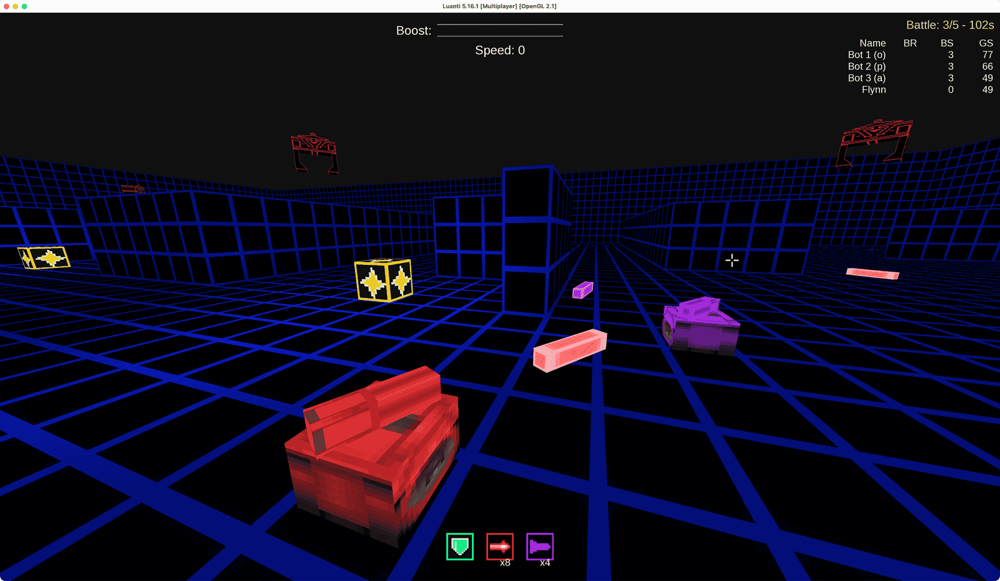

A 3D multiplayer Tron-style tank battle game for [Luanti](https://www.luanti.org/)
(formerly Minetest). Drive a tank around a maze arena, aim your turret
freely with the mouse independent of which way you're facing, and derez
opponents with laser and rocket fire. Driving into a wall or another tank
just stops you — only getting shot (or driving into a pit, on maps that
have one) eliminates you. Laser bolts bounce off walls instead of being
destroyed by them, so a well-aimed ricochet can catch someone around a
corner — rockets don't bounce, they just detonate on whatever they hit
first, wall or tank.

Pick up a boost powerup to fill your boost bar, then hold Shift for extra
speed while driving; collect shield powerups to absorb one incoming shot
instead of being derezzed by it; laser powerups to fire a fast, precise
bolt at an opponent; and rocket powerups for a slower but far more
destructive shot that blows out a 3x3 area on impact, catching anyone
else standing in it too.

This is a full standalone **game**, not a mod you add to something else — just install it and play.

## Installing

1. Install [Luanti](https://www.luanti.org/).
2. Run the latest installer for your platform from [Releases](https://github.com/xlvisuals/luanti_battletanks_game/releases/latest).

Alternatively, you can simply download a .zip of this and copy it's content into a `battletanks` directory in Luanti's `games/` directory:
   - **Windows**: `%APPDATA%\Minetest\games\battletanks\`
   - **Linux**: `~/.minetest/games/battletanks/`
   - **macOS**: `~/Library/Application Support/minetest/games/battletanks/`
   - **Dedicated server**: `<server install dir>/games/battletanks/`
   - You can also find the folder by starting Luanti, then clicking on "Open User Data Directory" in the "About" panel.

## Running

1. Launch Luanti
2. Go to **Start Game**, and pick **BattleTanks** as the game
3. When running for the first time, click **New** to create a world (any name/seed — the game creates the default map)
4. Click **Play Game**
   - If you want to host a server, check **Host Server** below the `Start Game` tab, then click **Host Game**.

## Multiplayer

BattleTanks is meant to be played with other people, but it also works
fine solo against the time or against bots.

### Playing alone with your own player name

If you launch a world by clicking "Play Game", Luanti starts the game in 
Singleplayer mode, In this mode Luanti hardcodes your player name to 
`singleplayer` — this is an engine-level reservation.

To play solo under your own name instead, check the "Host Server" 
checkbox on the left and leave **Announce Server** unchecked.
That allows you to set a player name in the Name field. The 
"Play Game" button becomes "Host Game", but you're only hosting for yourself.
### Hosting for others

Same **Host Server** checkbox as above, but now:

- **Announce Server** — turn this on to list your game on Luanti's
  public server list, or leave it off and just share your IP/port with
  friends directly (e.g. over a LAN or a VPN).
- Anyone connecting picks their own player name on their own end when
  they join, the same as any other Luanti server.
- The player who started the server automatically becomes the admin and 
  can configure the game and edit maps. Players that join remotely can 
  only join and leave a game and start it, but cannot change settings.
  To make someone else an admin too, run `/grant <name> lobby_admin`.

## Playing

Once you're in the world, everyone gets a lobby panel automatically —
press **E** any time you're not actively racing to bring it back up if
you've closed it. From there (or via chat commands, below) you can join
the waiting roster and start a battle once there are enough players (an
admin can start solo, for testing).

The very first time anyone starts a battle on a fresh world, the arena is
built automatically — this can take a moment the first time, then it's
instant.

### Controls

| Key | Effect |
|---|---|
| **A / D** | Snap-turn your tank body 90° left/right |
| **W** | Drive forward |
| **S** | Drive backward (slower than forward) |
| **Mouse** | Aim your turret — independent of which way your tank body is facing |
| **Shift** (hold) | Boost: extra speed while your boost bar has charge |
| **Space** or **left-click** | Fire a laser shot (requires laser ammo) |
| **E** (Aux key) or **right-click** | Fire a rocket (requires rocket ammo). Outside of a battle, instead opens the lobby menu |
| **C** | Change camera view |

Movement only happens while you hold a direction — release and you stop.
Driving into a wall or another tank just stops you in place. Only a shot 
(or a pit, on maps that have one) can derez you.

A crosshair marks the exact point your next shot would hit. It's anchored
to that point in the world, not fixed to the screen, so it can appear to
move up or down as you tilt the camera — that's intentional.

### Observing and spectating

Anyone connected but not currently in the match — hasn't joined yet, or
is waiting for the next one — moves and looks around freely (fly/fast/
noclip, granted automatically and revoked the instant they actually start
playing) instead of being frozen in place, so you can always get a good
view of a battle in progress even without joining it.

While a battle or its countdown is running, press **left-click** to
attach your camera to another player's tank and watch from just above
it — pressing again cycles to the next racer and back to your own
free-fly view.

A player who gets derezzed automatically drops into a similar spectator
view of whoever's still alive, cycled the same way — **left-click**.

### Scoring

Every player scores based on how long they lasted, not just the winner. The first player 
to be eliminated places last, the last player standing on the map places first.

| Placement | Points |
|---|---|
| 1st | 25 |
| 2nd | 18 |
| 3rd | 15 |
| 4th | 12 |
| 5th | 10 |
| 6th | 8 |
| 7th | 6 |
| 8th | 4 |

A battle with no survivors doesn't award 1st place to anyone, since nobody
actually won. Players eliminated simultaneously (e.g. caught in the same
rocket blast) share the same placement, and the next rank down is left
vacant.

On top of placement, collecting a point powerup adds 3 points, and
eliminating an opponent with a laser or rocket shot adds 5.

Scores accumulate between battles but reset each game — either when a second 
player joins after someone's been playing solo, or after a set number of battles 
(5 by default, admin-configurable), at which point whoever has the most points
is declared the overall winner and everyone starts fresh. 

A live "Battle: N/M" counter (with a running clock) is always visible, and while a
battle is in progress it's joined by a live standings table showing everyone's 
rank in the current battle, this battle's running score, and their overall game score 
— sorted by whoever's still alive first, then by points.
That same table shows the final result at the end of a battle or game until the next
one starts.

When one player is playing solo (no other players, no bots) the game ends when the last 
point powerup was collected - it's a battle against time to collect them as fast as possible.

### Score table

The score table shows each player's name, rank in the current battle, battle score 
(including awarded points), and overall game score: 
- Name : Player name.
- BR : Battle Rank - the rank in the current battle.
- BS : Battle Score - points earned in the current battle. Battle Rank points are awarded at the end of the battle.
- GS : Game Score - sum of all Battle Scores.

### Powerups

Five kinds may appear on a given map, depending on how it's set up (an
admin can toggle each on/off from the lobby panel). Boost, shield, laser,
and rocket powerups each spawn on their own timer and cap out at a
configurable number of unclaimed instances on the arena at once (5 by
default for shield/laser/rocket, 3 for boost) — once that many are
already out there, a spawn event is simply skipped rather than piling up
further:

- **Point powerup** — placed as part of the level itself, worth bonus
  points on pickup (3 by default). Doesn't respawn until the next battle.
- **Boost powerup** — spawns at a random spot during a battle and vanishes
  if not grabbed in time; instantly refills your boost bar.
- **Shield powerup** — absorbs the next laser or rocket hit that would
  otherwise derez you, consuming one charge.
- **Laser powerup** — grants laser bolt (10 by default). A laser bolt is
  fast and precise, bouncing off walls (up to 3 times before fizzling out)
  and eliminating a single opponent on a direct hit. A bounced shot can derez 
  the shooter themselves, if unlucky enough to be standing in its path.
- **Rocket powerup** — grants rockets (5 by default). A rocket is
  slower than a laser bolt and doesn't bounce off anything: it detonates
  on hitting either a tank or a wall, destroying a 3x3 area and
  eliminating every player caught standing in it, not just whichever it
  directly hit  — including the shooter themselves,

### Recognizers

Admins can turn these on from the lobby panel: one flying sentry per tank,
patrolling above the maze and tracking its own tank from the air. They
exist to add atmosphere and discourage camping — sit in one spot too long 
and the Recognizer hunting you will catch up and stomp you.

Your cannon can't normally aim upward, but aiming at the ground directly
beneath a Recognizer locks your crosshair onto it instead, so your next 
laser or rocket shot fires upward and hits it. This only works from a 
certain distance out: a Recognizer flying close to directly overhead is 
too steep an angle for the cannon to reach.

A Recognizer takes three hits to bring down — one for each leg, then the
body — and pays out points (5 by default) on that final hit. It respawns
a few seconds later (10 by default), unless the tank itself gets derezzed 
by anything else first, in which case its Recognizer goes down with it.

### Bots

Admins can add bots to singleplayer and multiplayer games. There are three bot behaviors: passive, opportunistic, and aggressive.

- **Passive** - Heads for the nearest point powerup anywhere on the map (point powerups are placed as part of the level and don't expire, unlike the others, making them a sensible standing objective) - navigating there with the same wall-following steering described below. Never goes out of its way for a boost/shield/laser/rocket powerup or an enemy, though it'll still pick one up if driving past it.
- **Opportunistic** - Commits to the nearest powerup of any kind within a limited range (default: 10 nodes) the instant one comes into range, staying committed until it's reached, gone, or blocked. Falls back to the same point-powerup-seeking as Passive when nothing's within that range, rather than just wandering.
- **Aggressive** - Heads straight at the nearest other tank until it's within 3 nodes, turning to line up a shot if needed. Prioritizes staying combat-ready over hunting: heads for the nearest laser or rocket powerup, whenever its total ammo drops below 5 and heads for the nearest shield powerup if it's out of shields; Falls back to the nearest powerup of any kind, anywhere on the map, if none of the above found anything reachable this tick.

All behaviors share the same base obstacle avoidance: look ahead along the current heading; if blocked, turn toward whichever side is clear; if both sides are safe, weigh toward whichever has more open room further out. If a bot ever goes about 2 seconds without actually making progress - stuck against something this steering can't resolve on its own, like a dead-end corner needing a full U-turn rather than a single turn - it backs up about 3 nodes to clear whatever it's touching, then commits to a random turn and continues, reassessing from there.

Bots use shields automatically and boost automatically whenever they have charge available.

Bots aim their turret independently of their hull direction at the nearest enemy tank within 20 nodes. To simulate the time it takes a human player to aim, bots require half a second (`bot_shoot_delay`) of continuous, unbroken line of sight on the same target before they can shoot. Losing sight or switching targets resets that buildup. 

The admin can choose the number of bots in a game and their behavior. Choosing "random" will assign each bot a random behavior from one of the three for the duration of the game. A bot's name shows their assigned behavior in the name: - `(p)` for passive, `(o)` for opportunistic, and `(a)` for aggressive. 
 

### Chat commands

Everyone:

- **`/bt`** or **`/bt menu`** — opens the lobby panel
- **`/bt join`** — join the lobby
- **`/bt leave`** — leave the lobby
- **`/bt start`** — start a battle
- **`/bt score`** — shows your current score in chat
- **`/bt help`** — opens the in-game help screen

Admin-only:

- **`/btspawns`** — lists every spawn point on the current map
- **`/btspawns <1-8>`** — teleports you to that exact spawn point, facing
  the way that racer would
- **`/btpause`** — pauses battle movement and grants yourself free-look
  and free-move (e.g. to line up a screenshot); run it again to resume.
  The clock keeps running while movement is paused. Can also be triggered
  by a key press instead of typing the command
- **`/bt show [score|names|battle|boost|messages|all]`** — shows the
  scoreboard, player names above tanks, the battle counter, the boost bar,
  big on-screen flash notifications, or everything (the default)
- **`/bt hide [score|names|battle|boost|messages|all]`** — hides the same

## Building custom maps

Admins can build custom arena layouts using an in-game "build mode."
Click **Enter Build Mode** in the lobby panel to get fly/noclip/give
privileges and a set of tools for editing the arena:

- **Disc** — a fast-digging tool.
- **Boundary** — the ground and boundary block; right-click to place. Use it
  to lay out a maze's internal walls too, not just the outer boundary.
- **Point-powerup spawner** — place one to spawn a point powerup above it
  each battle.
- **8 numbered player-spawn markers** — place these to define exactly
  where (and which direction) each racer starts.

Place spawner and player-spawn blocks at ground level, the same height as
the wall blocks — the powerup or player itself spawns just above the
marker. A player spawns facing whichever direction you were facing when
you placed their marker. Boost, shield, laser, and rocket powerups don't
need spawners at all — they appear at random spots on their own.

Use the `giveme` command to refill any blocks you run out of or lost:
- `/giveme battletanks:boundary 99`
- `/giveme battletanks:powerup_point_spawner 99`
- `/giveme battletanks:spawnpad_1 1`
- `/giveme battletanks:spawnpad_2 1`
- `/giveme battletanks:spawnpad_3 1`
- `/giveme battletanks:spawnpad_4 1`
- `/giveme battletanks:spawnpad_5 1`
- `/giveme battletanks:spawnpad_6 1`
- `/giveme battletanks:spawnpad_7 1`
- `/giveme battletanks:spawnpad_8 1`
- `/giveme battletanks:build_pick 1`
  
You might have to check your inventory (**I**) in case the blocks didn't land in a hotbar slot. 
Make sure to only have only one of each spawnpad and that they point in the desired direction.

Once you're happy with a layout, bring the lobby panel back up (**E**)
and press **Save Map** to save it under a new name — this captures the
current arena as a `.mts` schematic in the world folder, and it
immediately becomes selectable from the map dropdown.

## Debugging bot behavior

Three settings in `mods/battletanks/settings.lua` exist purely to make
testing bots easier:

- **`admin_invincible`** — when `true`, anyone with the `lobby_admin`
  priv can never be derezzed, by a shot or a pit, while playing. Shots
  aimed at an invincible admin have no effect at all - no shield drain,
  no kill credited to the shooter - they just don't count as a valid
  target.
- **`allow_bots_only_match`** — when `true`, a match can be started (and
  will keep running) with zero human players, purely to watch bots play
  each other.
- **`bot_debug_logging`** — when `true`, every bot logs to the server log
  (never chat, so it can't spam players) whenever its high-level intent
  changes - e.g. `[BattleTanks] Bot 1 (a): hunting Bot 2`. See
  `BOT_AI.md` for details on what gets logged and why.

## Screenshots

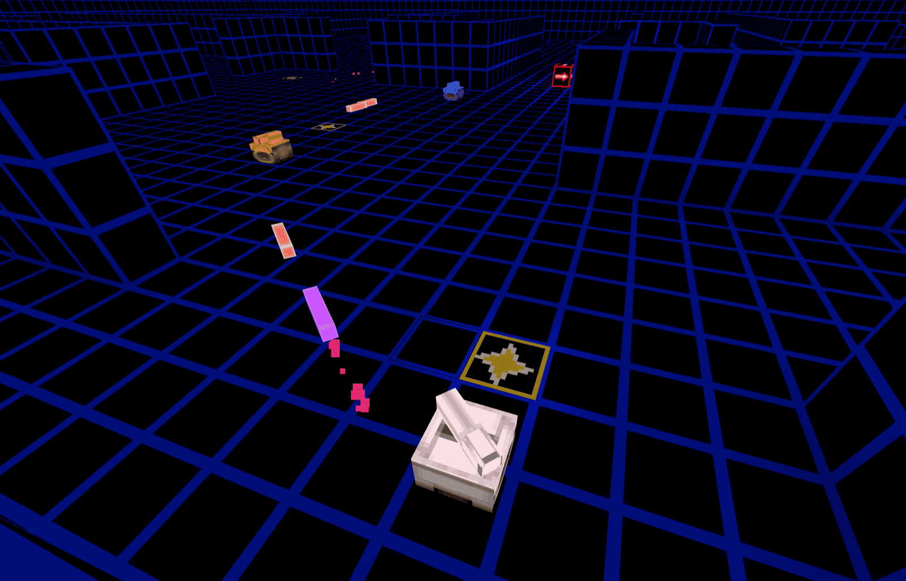

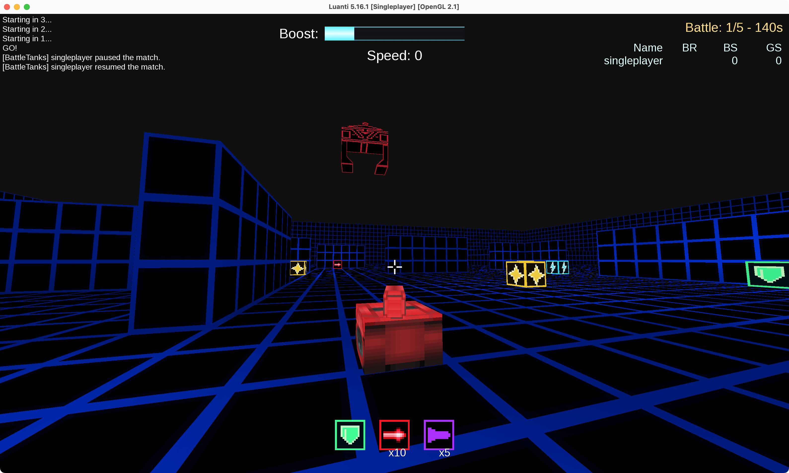

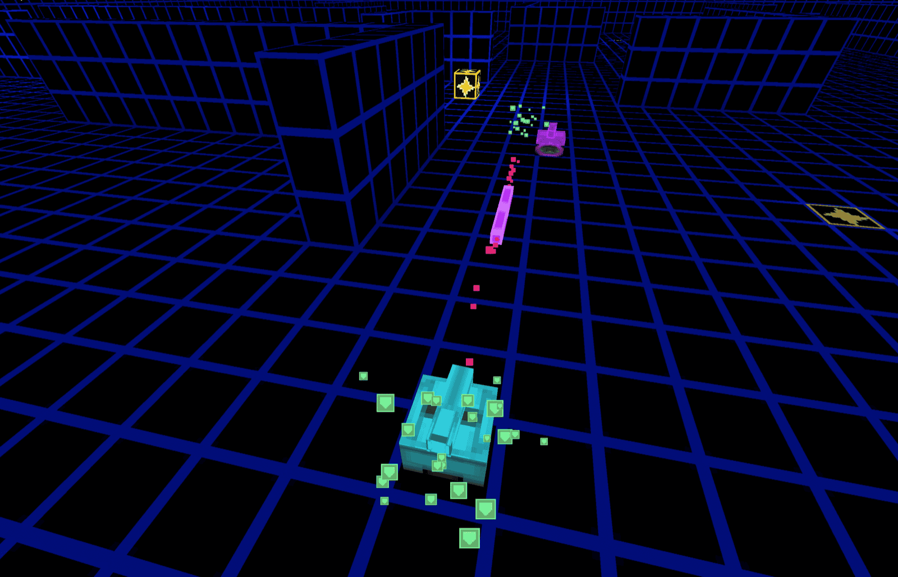

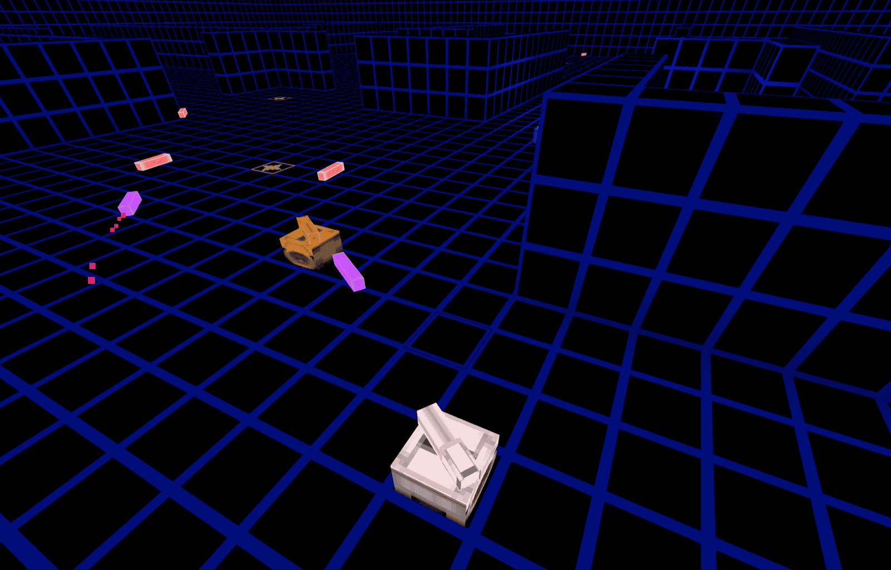

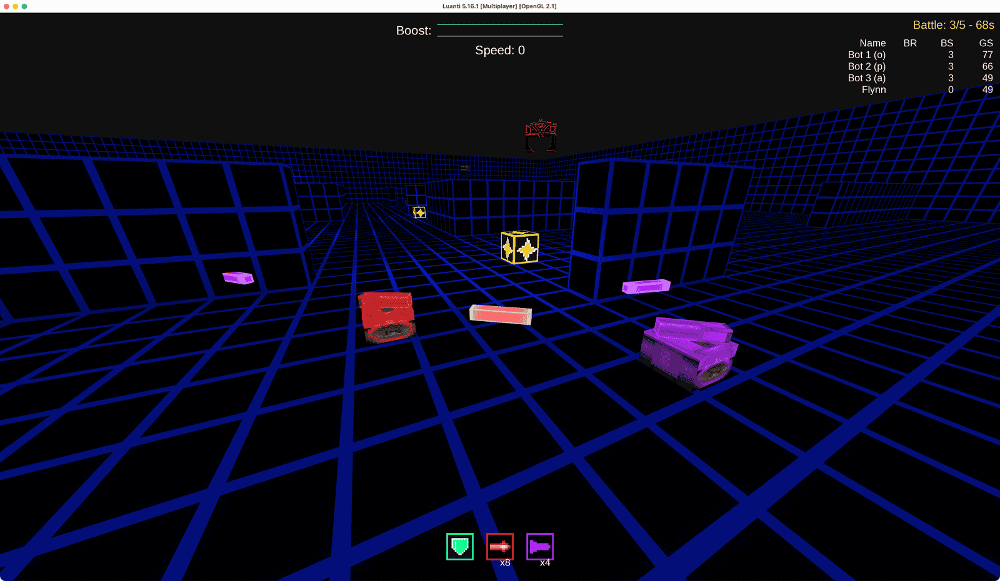

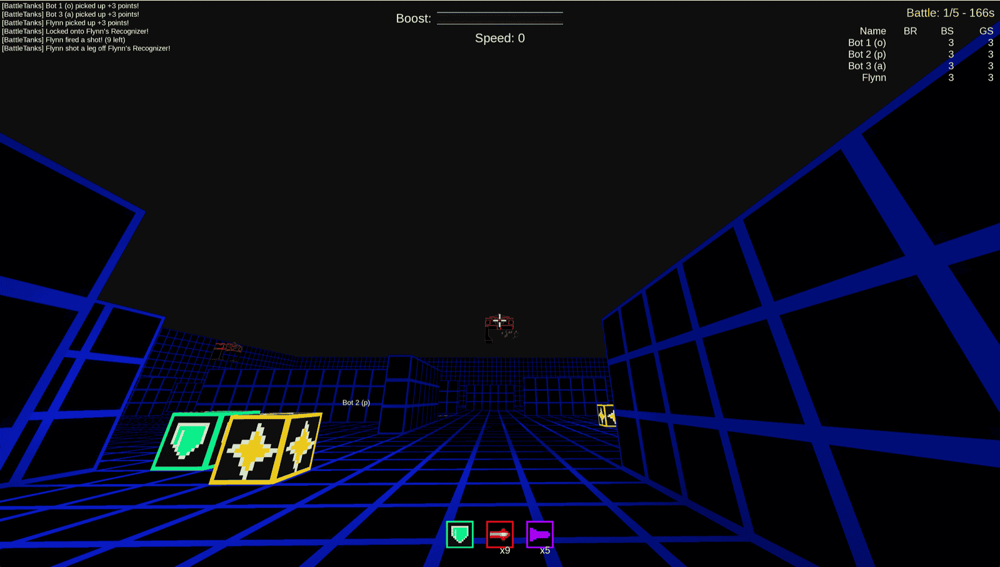

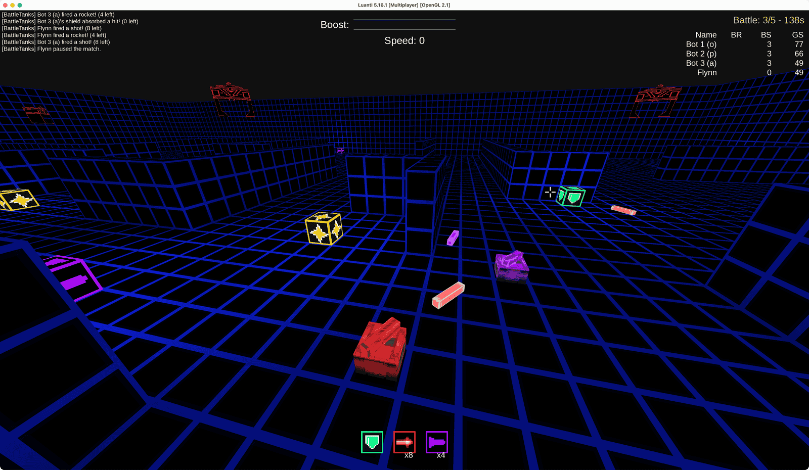

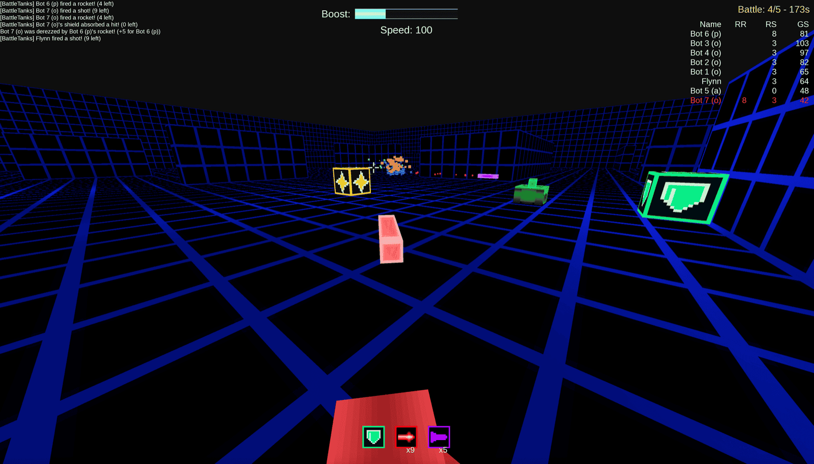

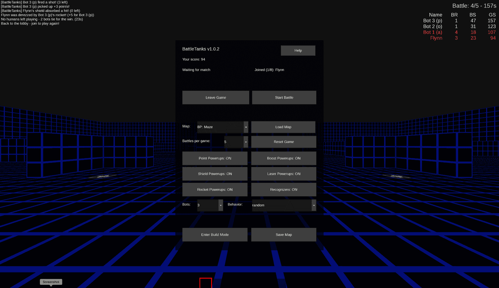

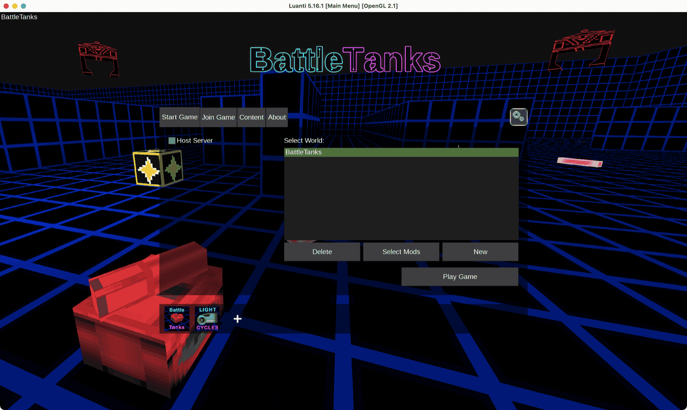

## Credits & License

- **Code**: LGPL-2.1-or-later — see [`LICENSE`](LICENSE).
- Built by Xlvisuals, with code architecture, implementation, and some
  placeholder art developed in collaboration with Claude (Anthropic).
